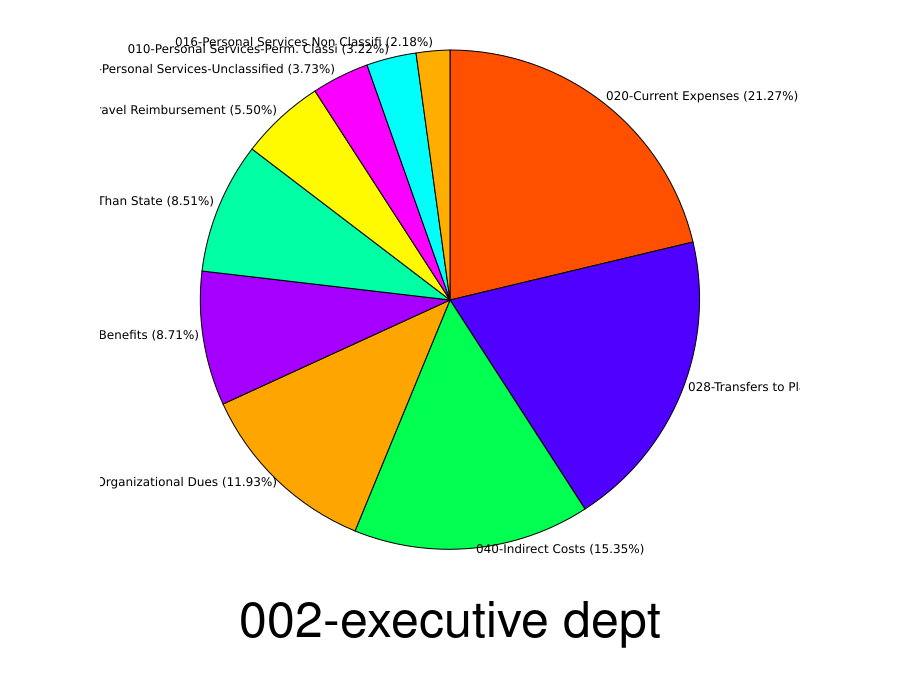

This is a tool that can be used to analyze the NH state budget.

It has several modes of operation (discussed below).

# Installation


1. Download or git clone this package.
1. make sure you have ruby installed (`sudo apt-get install ruby` on Ubuntu)
1. make sure you have image magick installed (`sudo apt-get install imagemagick` on Ubuntu)
1. `git clone git@github.com:cbdevnet/piechart.git`
1. `cd piedchart`
1. `make`
1. `make install`
1. `cd ..`
1. download an excel file for a budget from [here](https://www.das.nh.gov/budget/)
1. open the excel file in OpenOffice or similar and export as a CSV.

Steps 3 and 4 have already been done for you, and the CSV file is included as part of this package.

# Use

## Generating a Sankey diagram

This tool can generate a [Sankey digram](https://en.wikipedia.org/wiki/Sankey_diagram).

To do so:

1. `rake sankey > nh_budget_for_sankey.txt`
2. go [here](https://sankeymatic.com/build/) and upload the file generated in step 1


## Analyze the budget looking for weird outliers

1. `rake analyze`

You will get text output, which lists each category of spending (along
with what percentage of its entire budget the average NH department
spends), and then lists the top 10 state departments ranked by actual
percentile spending in this cost category.

e.g.

```
---- 019-Holiday Pay avg = 1.28%, std_dev = 7.00 points 
  * 51.79% +  8 std devs    013-PEASE DEVELOPMENT AUTHORITY
  *  4.95% +  1 std devs    046-CORRECTIONS DEPT
  *  4.53% +  1 std devs    043-VETERANS HOME
  *  3.97% +  1 std devs    094-HHS: NH HOSPITAL
  *  2.88% +  0 std devs    096-TRANSPORTATION DEPT
  *  2.29% +  0 std devs    023-SAFETY DEPT
  *  1.72% +  0 std devs    091-HHS: GLENCLIFF HOME
  *  0.98% +  0 std devs    090-HHS: PUBLIC HEALTH DIV
  *  0.32% +  0 std devs    027-EMPLOYMENT SECURITY DEPT
  *  0.30% +  0 std devs    042-HHS: HUMAN SERVICES DIV
```

shows that the average department spends 1.28% of its budget on
holiday pay, but the Pease Development Authority spends 51.79% of its
budget on this.

## Analyze departments

This option is the reverse of "analyzing by categories" (above).  This analyzes by department.

For each department, break down how it spends money (and prints it to std out)

Also generates on piechart per department and writes it to `/tmp`.

1. `rake department`

e.g.



## Find alarming headcount numbers

1. `rake headcount`


# Authorship

This package was written by [Travis Corcoran](https://en.wikipedia.org/wiki/Travis_Corcoran).  I am a state rep in NH and you can find me on twitter at [@travis4nh](https://x.com/travis4nh).

# Licensing

This package is not yet licensed.  I'll almost certainly open source it.

# Canonical location

[https://github.com/Travis4nh/nh_budget_sankey](https://github.com/Travis4nh/nh_budget_sankey)

# Bug reports and feature requests

Please feel free to [create a ticket](https://github.com/Travis4nh/nh_budget_sankey/issues).


